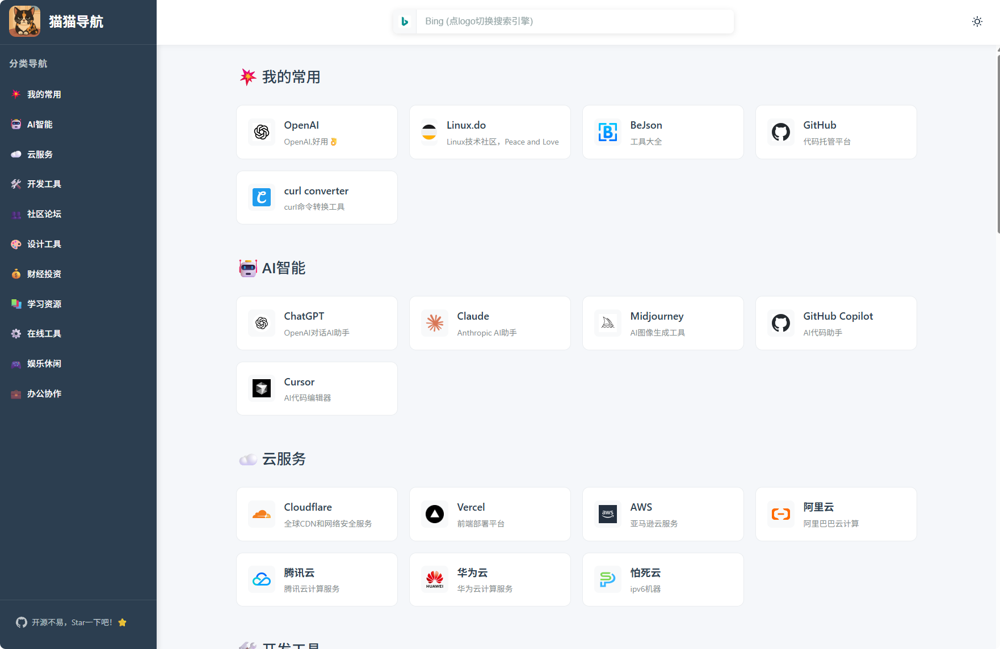

# 🐱 猫猫导航 (Mao Nav)

> 一个简洁美观的个人导航网站，支持分类管理和自定义收藏夹

[](https://opensource.org/licenses/MIT)
[](https://vuejs.org/)
[](https://vitejs.dev/)
[](https://pages.cloudflare.com/)
[](https://vercel.com/)

## 🛠️ 更新记录
- 2025-07-15 完善logo自动获取流程。
- 2025-07-16 修复admin 管理后台编辑相关问题，优化编辑逻辑。
- 2025-07-17 增加网站名称修改，站点logo,修改调整手机端排版。
- 2025-07-22 增加站点拖拽排序，优化icon获取。
- 2025-07-30 修复item展示问题，增加环境变量VITE_OPEN_LOCK，配置首页也需验证密码。
- 2025-08-11 增加夜间模式，增加默认搜索引擎设置功能。
- 2025-03-25 **v2.0.0** 安全架构升级：密钥迁移至服务端 Functions，同时支持 Cloudflare Pages 和 Vercel 部署。

## 🔄 从 v1.x 升级到 v2.0

v2.0 将敏感密钥（管理员密码、GitHub Token）从前端迁移到了服务端 Functions，**前端代码不再包含任何敏感信息**。

### 升级步骤

**1. 同步代码**

```bash
# 如果你 fork 了本项目，同步上游代码
git fetch upstream
git merge upstream/master
```

**2. 修改部署平台的环境变量**

在 Cloudflare Pages / Vercel 的环境变量设置中：

| 操作 | 变量名 | 说明 |
|---|---|---|
| **新增** | `ADMIN_PASSWORD` | 值与原来的 `VITE_ADMIN_PASSWORD` 一致，**设置为 Encrypted 类型** |
| **新增** | `GITHUB_TOKEN` | 值与原来的 `VITE_GITHUB_TOKEN` 一致，**设置为 Encrypted 类型** |
| **保留** | `VITE_GITHUB_OWNER` | 不变 |
| **保留** | `VITE_GITHUB_REPO` | 不变 |
| **保留** | `VITE_GITHUB_BRANCH` | 不变 |
| **删除** | `VITE_ADMIN_PASSWORD` | 已迁移到服务端，不再需要 |
| **删除** | `VITE_GITHUB_TOKEN` | 已迁移到服务端，不再需要 |

**3. 重新部署**

修改环境变量后，触发一次重新部署即可。

> **注意**：如果你不删除旧的 `VITE_` 密钥变量，它们仍会被打包到前端代码中。请务必删除 `VITE_ADMIN_PASSWORD` 和 `VITE_GITHUB_TOKEN`。

## 效果预览
示例站点: [猫猫导航](https://nav.maodeyu.fun)


## ✨ 特性

- 🎨 **现代化设计** - 简洁美观的界面，支持响应式布局
- 📱 **多设备适配** - 完美支持桌面端、平板和移动端
- 🔥 **分类管理** - 支持自定义分类和网站管理
- ⚡ **快速访问** - 基于 Vue 3 + Vite 构建，加载速度极快
- 🌐 **免费部署** - 支持 Cloudflare Pages 和 Vercel 免费部署
- 🛠️ **易于定制** - 简单的配置即可个性化你的导航
- 👨‍💻 **管理界面** - 可选配置管理员界面，支持可视化添加/编辑分类和网站
- 🔒 **安全架构** - 管理员密钥和 GitHub Token 存储在服务端，前端代码不包含任何敏感信息


## 🚀 快速开始
图文教程可访问[猫猫导航图文教程](https://blog.maodeyu.fun/2025/07/16/nav_mao/)
### 🚀 部署到 Cloudflare（推荐）

**1. Fork 本项目**
- 点击页面右上角的 **"Fork"** 按钮
- 将项目 Fork 到你的 GitHub 账号下

**2. 在 Cloudflare Pages 控制台部署**
1. 访问 [Cloudflare Dashboard](https://dash.cloudflare.com)
2. 注册/登录 Cloudflare 账号（免费）
3. 点击左侧菜单 **"Workers & Pages"**
4. 点击 **"Create application"** → **"Pages"** → **"Connect to Git"**
5. 授权 GitHub 并选择你 Fork 的 `mao_nav` 仓库
6. 配置构建设置：
   - **Framework preset**: `Vue`
   - **Build command**: `npm run build`
   - **Build output directory**: `dist`
7. 配置环境变量（见下方[环境变量配置](#-环境变量配置)）
8. 点击 **"Save and Deploy"**

✅ **完成！** 几分钟后你就有了自己的导航网站，每次修改代码都会自动重新部署。

**3. 自定义你的导航**
- 编辑 `src/mock/mock_data.js` 文件，添加你自己的网站分类和链接
- 提交更改，Cloudflare 会自动重新部署

**4. 绑定自定义域名（可选）**
- 在 Cloudflare Pages 项目设置中点击 **"Custom domains"**
- 添加你的域名并按提示配置 DNS

---

### 🚀 部署到 Vercel

**1. Fork 本项目**
- 同上，先 Fork 到你的 GitHub 账号

**2. 在 Vercel 控制台部署**
1. 访问 [Vercel 官网](https://vercel.com/)
2. 注册/登录 Vercel 账号（免费）
3. 点击右上角 **"Add New"** → **"Project"**
4. 选择你 Fork 的 `mao_nav` 仓库，点击 **"Import"**
5. 保持默认设置，Vercel 会自动检测到是 Vue 项目
   - **Framework Preset**: `Vite`
   - **Build Command**: `npm run build`
   - **Output Directory**: `dist`
6. 配置环境变量（见下方[环境变量配置](#-环境变量配置)）
7. 点击 **"Deploy"**

✅ **完成！** 部署成功后会自动生成一个 vercel.app 域名，每次推送代码会自动重新部署。

**3. 自定义你的导航**
- 编辑 `src/mock/mock_data.js` 文件，添加你自己的网站分类和链接
- 提交更改，Vercel 会自动重新部署

**4. 绑定自定义域名（可选）**
- 在 Vercel 项目设置中点击 **"Domains"**
- 添加你的域名并按提示配置 DNS

---

### 🔐 环境变量配置

v2.0 起，敏感密钥存储在服务端（通过 Serverless Functions），前端代码不包含任何敏感信息。

在部署平台（Cloudflare Pages / Vercel）的 **Environment Variables** 中配置：

#### 服务端密钥（不加 VITE_ 前缀，前端不可见）

> **重要**：这两个变量请在部署平台中设置为 **Encrypted（加密）** 类型：
> - Cloudflare Pages：添加变量时选择 **Encrypt** 按钮
> - Vercel：添加变量时勾选 **Sensitive** 选项
>
> 加密后变量值在后台不可查看，防止他人登录你的平台账号后直接看到密钥。

| 变量名 | 必填 | 类型 | 说明 |
|---|---|---|---|
| `ADMIN_PASSWORD` | 是 | Encrypted | 管理员登录密钥，自定义任意字符串 |
| `GITHUB_TOKEN` | 是 | Encrypted | GitHub Personal Access Token，用于读写仓库文件 |

#### 前端配置（VITE_ 前缀，构建时注入）

| 变量名 | 必填 | 说明 |
|---|---|---|
| `VITE_GITHUB_OWNER` | 是 | GitHub 仓库所有者（你的用户名） |
| `VITE_GITHUB_REPO` | 是 | GitHub 仓库名称（默认 `mao_nav`） |
| `VITE_GITHUB_BRANCH` | 否 | GitHub 分支（默认 `master`） |
| `VITE_OPEN_LOCK` | 否 | 设置任意值启用首页访问锁定 |

> **安全说明**：`ADMIN_PASSWORD` 和 `GITHUB_TOKEN` 通过服务端 Functions 使用，永远不会出现在前端 JS 代码中。即使打开浏览器 DevTools 也无法看到这些密钥。

#### 获取 GitHub Personal Access Token

1. 访问 [GitHub Settings → Developer settings → Personal access tokens](https://github.com/settings/tokens)
2. 点击 "Generate new token" → "Generate new token (fine-grained token)"
3. 设置 Token 名称，选择过期时间，并**只选择你的 mao_nav 仓库**
4. 在 **Repository permissions** 部分，勾选：
   - `Contents` - **Read and write** ✅
   - `Metadata` - **Read** ✅
5. **Account permissions** 部分不需要勾选任何权限
6. 点击 "Generate token" 并复制（只显示一次）

---

### 🛠️ 管理员界面（可选）

配置好环境变量后，访问 `/admin` 路径即可进入管理后台：

1. 输入管理员密钥登录（服务端验证，密码安全）
2. 在界面中添加、编辑或删除分类和网站
3. 点击"保存到GitHub"按钮保存更改
4. 系统会自动在 2-3 分钟内重新部署

---

### 本地开发

1. **克隆项目**
```bash
git clone https://github.com/your-username/mao_nav.git
cd mao_nav
```

2. **安装依赖**
```bash
npm install
```

3. **配置环境变量**

创建 `.env` 文件（前端变量）：
```
VITE_GITHUB_OWNER=your_github_username
VITE_GITHUB_REPO=mao_nav
VITE_GITHUB_BRANCH=master
```

创建 `.dev.vars` 文件（服务端密钥，仅 wrangler 使用）：
```
ADMIN_PASSWORD=your_password
GITHUB_TOKEN=your_github_token
```

4. **启动开发服务器**

纯前端开发（不含 Functions）：
```bash
npm run dev
```

完整本地测试（含 Functions，需安装 wrangler）：
```bash
npm run build && npx wrangler pages dev dist
```

### 项目结构

```
mao_nav/
├── src/
│   ├── apis/           # API 接口
│   ├── assets/         # 静态资源（图片、样式等）
│   ├── components/     # Vue 组件
│   ├── mock/           # 模拟数据
│   ├── router/         # 路由配置
│   ├── stores/         # Pinia 状态管理
│   ├── views/          # 页面组件
│   ├── App.vue         # 根组件
│   └── main.js         # 入口文件
├── functions/           # Cloudflare Pages Functions (服务端)
│   └── api/
│       ├── verify.js    # 管理员密钥验证
│       └── github.js    # GitHub API 代理
├── api/                 # Vercel Serverless Functions (服务端)
│   ├── verify.js        # 管理员密钥验证
│   └── github.js        # GitHub API 代理
├── public/              # 公共静态文件
├── index.html           # HTML 模板
├── package.json         # 项目配置
├── vite.config.js       # Vite 配置
└── vercel.json          # Vercel 部署配置
```

## 🎯 自定义配置

### 修改导航数据

有两种方式来自定义你的导航分类和网站：

**方式1：直接编辑文件（推荐）**
编辑 `src/mock/mock_data.js` 文件来自定义你的导航分类和网站：

```javascript
export const mockData = {
  categories: [
    {
      id: "my-favorites",
      name: "我的常用",
      icon: "💥",
      order: 0,
      sites: [
        {
          id: "example",
          name: "示例网站",
          url: "https://example.com",
          description: "网站描述",
          icon: "https://example.com/favicon.ico"
        }
      ]
    }
  ]
}
```

**方式2：使用管理员界面（可选）**
如果你配置了管理员界面（见上方配置说明），可以通过以下步骤可视化管理：

1. 访问 `https://your-domain.com/admin`
2. 输入管理员密钥登录
3. 在界面中添加、编辑或删除分类和网站
4. 点击"保存到GitHub"按钮保存更改
5. 系统会自动在 2-3 分钟内重新部署

### 自定义样式

- 主要样式文件：`src/assets/main.css`
- 基础样式：`src/assets/base.css`


## 🛠️ 开发命令

```bash
# 开发模式
npm run dev

# 构建生产版本
npm run build

# 预览生产版本
npm run preview

# 代码检查和修复
npm run lint

# 本地完整测试（含 Functions）
npm run build && npx wrangler pages dev dist
```

## 📋 部署清单

在部署前请检查：

- [ ] 已修改 `src/mock/mock_data.js` 为你的个人数据
- [ ] 已在部署平台配置服务端密钥（`ADMIN_PASSWORD`、`GITHUB_TOKEN`）
- [ ] 已在部署平台配置前端变量（`VITE_GITHUB_OWNER`、`VITE_GITHUB_REPO`）
- [ ] 已测试构建命令 `npm run build`
- [ ] 已验证 `dist` 目录生成正常

## 🤝 贡献

欢迎提交 Issue 和 Pull Request！

1. Fork 本项目
2. 创建你的特性分支 (`git checkout -b feature/AmazingFeature`)
3. 提交你的修改 (`git commit -m 'Add some AmazingFeature'`)
4. 推送到分支 (`git push origin feature/AmazingFeature`)
5. 打开一个 Pull Request

## 📄 许可证

本项目基于 MIT 许可证开源 - 查看 [LICENSE](LICENSE) 文件了解详情

## 🙏 致谢

- [LINUX DO](https://linux.do/) - 感谢 LINUX DO 社区的支持与认可
- [Vue.js](https://vuejs.org/) - 渐进式 JavaScript 框架
- [Vite](https://vitejs.dev/) - 下一代前端构建工具
- [Cloudflare Pages](https://pages.cloudflare.com/) - 现代化的 JAMstack 平台
- [Vercel](https://vercel.com/) - 前端云平台
- [Pinia](https://pinia.vuejs.org/) - Vue.js 状态管理库

## 📞 联系方式

如果你有任何问题或建议，欢迎通过以下方式联系：

- 提交 [Issue](https://github.com/your-username/mao_nav/issues)
- 发起 [Discussion](https://github.com/your-username/mao_nav/discussions)

---

⭐ 如果这个项目对你有帮助，请给它一个 Star！
